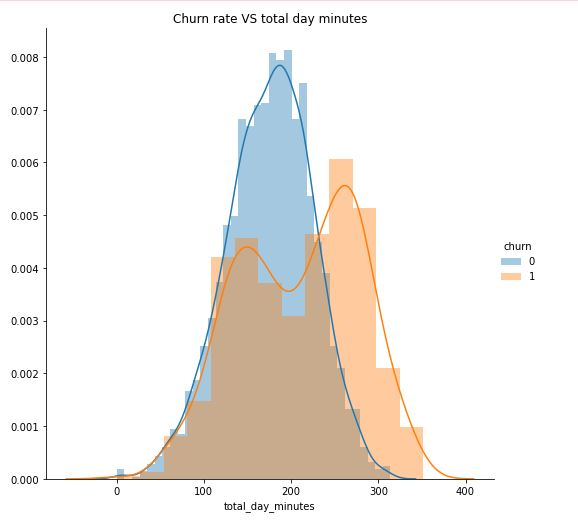
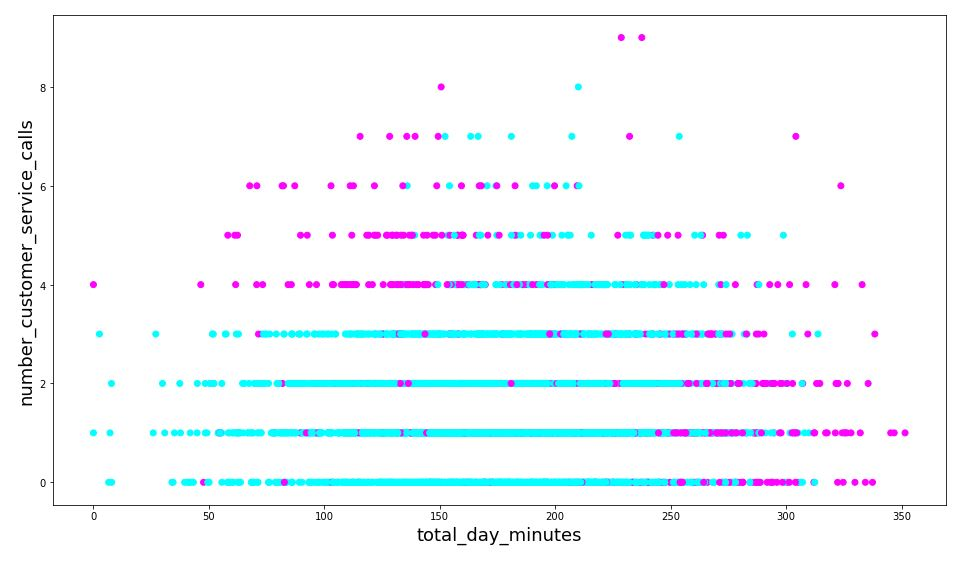
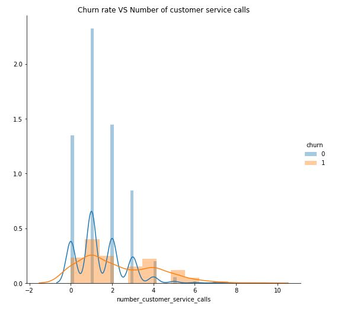

#  
Capstone Project
Jethro Low
DSIF-2
​
### Problem Statement
​
Problem Statement: From the perspective of a data analytics consultancy, to offer client (Telco) advise on how to reduce the churn rate.
Stakeholders: Client (Telco)
Method: Usage of machine learning methods to create a model to predict the churn.
Metric: Accuracy
Dataset: Kaggle Dataset. 
(Link: https://www.kaggle.com/c/customer-churn-prediction-2020/overview)
End-State: Advise that can be implemented to help the client reduce the churn rate.

### Datasets
​
From Kaggle: https://www.kaggle.com/c/customer-churn-prediction-2020/data
​
**Data Dictionary**
state, string. 2-letter code of the US state of customer residence
account_length, numerical. Number of months the customer has been with the current telco provider
area_code, string="area_code_AAA" where AAA = 3 digit area code.
international_plan, (yes/no). The customer has international plan.
voice_mail_plan, (yes/no). The customer has voice mail plan.
number_vmail_messages, numerical. Number of voice-mail messages.
total_day_minutes, numerical. Total minutes of day calls.
total_day_calls, numerical. Total number of day calls.
total_day_charge, numerical. Total charge of day calls.
total_eve_minutes, numerical. Total minutes of evening calls.
total_eve_calls, numerical. Total number of evening calls.
total_eve_charge, numerical. Total charge of evening calls.
total_night_minutes, numerical. Total minutes of night calls.
total_night_calls, numerical. Total number of night calls.
total_night_charge, numerical. Total charge of night calls.
total_intl_minutes, numerical. Total minutes of international calls.
total_intl_calls, numerical. Total number of international calls.
total_intl_charge, numerical. Total charge of international calls
number_customer_service_calls, numerical. Number of calls to customer service
churn, (yes/no). Customer churn - target variable.
​
### Summary of Recommendations
​

1. Recommendation 1:
	- Offer new product offering to cater to customers with different calling minute needs.
	- EDA shows that there could customers leaving due to a mismatch of product offering.
	
​
2. Recommendation 2:
	- Focus on customers that shows the profile of Churn but has yet to switch Telco.
	- A XGBoost model has been developed to identify this group of people. A Shapley analysis has also been completed.
	
	
3. Recommendation 3:
	- EDA shows there are some customers that switch Telcos because they are disatisfied with the service or experience.
	- For further analysis to see which areas are lacking and to be improved.
	
	
​
### Conclusion
​
The full Data analysis process was completed. From Data cleaning to EDA to Modelling and Evaluation. Some problems faced on the data imbalance but was resolved sufficiently. The XGBoost model is not overfitted and gave a good accuracy. The EDA revealed areas for the Telco to investigate and take action. The modelling and Shapley values gave insight to the customers who might churn in the near future.
